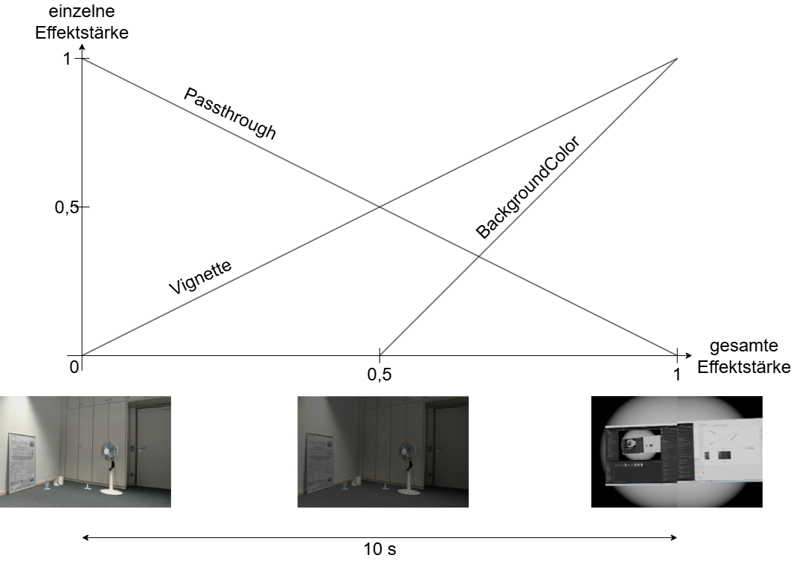

# FocusGuard

Prototyp einer Mixed-Reality-Anwendung zur Minimierung von Ablenkungen bei der PC-Arbeit,
entwickelt im Rahmen eines Teamprojektes am [Institut für Wirtschaftsinformatik](https://www.win.kit.edu/) (WIN).

Aktuell:

- wird der PC-Bildschirm in die MR-Umgebung gespiegelt,
- wird mittels Eye Tracking erkannt, ob der Benutzer auf den Bildschirm oder andere Regions of Interest (ROI) schaut,
- wird beim Feststellen einer Ablenkung eine Transition in eine vollständige VR-Umgebung ausgelöst,
- werden über die Webcam mittels Objekterkennung Personen im Raum erkannt und weiterhin über ein partielles Passthrough eingeblendet.

## Voraussetzungen

Das Projekt wurde mit folgendem System entwickelt und getestet:

- Windows 11
- Unity (Version 6000.3.14f1)
- VIVE Focus Vision Pro
- SteamVR (Version 2.16.7)
- VIVE Hub (Version 2.5.5)
- Webcam (Jabra PanaCast 20 o.ä. mit 90° horizontalem FOV)

## Installation und Programmstart

Genauere Installationsanweisungen finden sich in der [Projektdokumentation](docs/Teamprojekt26-FocusGuard.pdf).

1. Quellcode klonen: `git clone https://github.com/LarsEbner/FocusGuard.git`
2. Projektordner im Unity Hub suchen und Projekt öffnen
3. Szene `Assets > Scenes > Focus` hinzufügen und Standardszene löschen
4. VIVE Hub und SteamVR starten
5. SteamVR auf der VR-Brille starten
6. Anwendung in Unity über "Play" starten

Die notwendige Kalibrierung der Webcam ist in der Dokumentation beschrieben.
Wurde die Webcam für einen Raum bereits kalibriert, kann stattdessen auch das Programm jetzt beendet werden
und anschließend die Datei `%USERPROFILE%\AppData\LocalLow\DefaultCompany\FocusGuard\focusguard.json`
durch eine gültige Konfiguration ersetzt werden (z.B. [VR-Labor.json](VR-Labor.json) für den VR-Raum am WIN).

## Steuerung

Der virtuelle Bildschirm erscheint vor dem Benutzer und kann über die Thumbsticks des Controllers verschoben werden:

Thumbstick | Richtung     | Effekt
-----------|--------------|-----------------------------------------------
Links      | Vor/Zurück   | Verschiebung vom Benutzer weg/zum Benutzer hin
Links      | Links/Rechts | Bildschirm dreht sich um den Benutzer
Rechts     | Vor/Zurück   | Verschiebung nach oben/unten
Rechts     | Links/Rechts | Kippen des Bildschirms

Maus und Tastatur können normal verwendet werden.
Vor dem Benutzer befindet sich ein Passthrough, um sie auch bei aktiviertem Fokuseffekt zu sehen.
Dieses zählt zur ROI, damit der Effekt nicht versehentlich ausgelöst wird.

Über mehrfaches Drücken der Schultertaste des linken Controllers kann durch mehrere Debug-Optionen durchgeblättert werden,
die über die Schultertaste des rechten Controllers aktiviert und deaktiviert werden können.
Alternativ können die Debug-Skripte bereits unter `Focus > Scripts > Script: DebugController` im Inspektor (de-)aktiviert werden.

Die vollständige Liste der Debug-Optionen findet sich in der Dokumentation.
